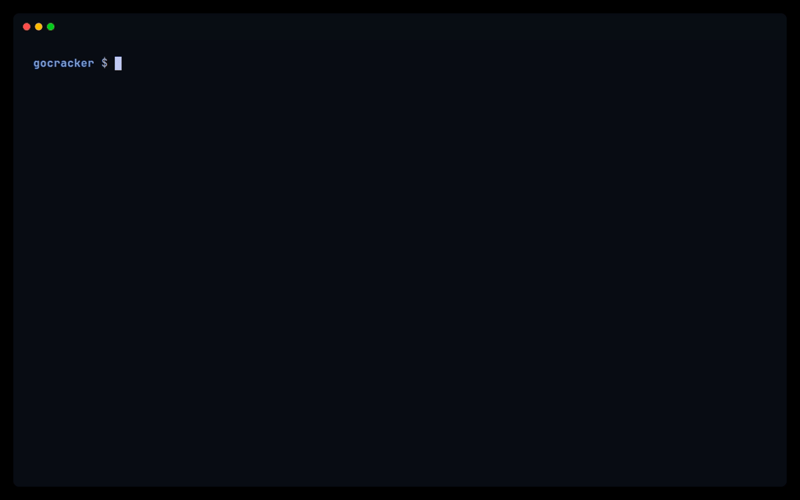
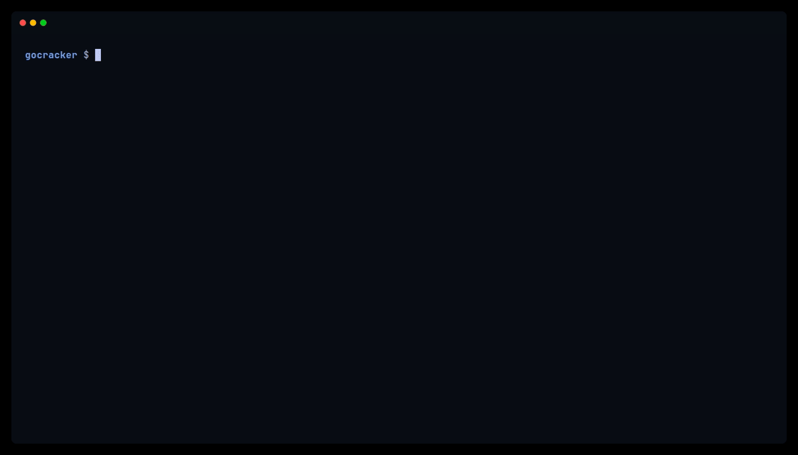
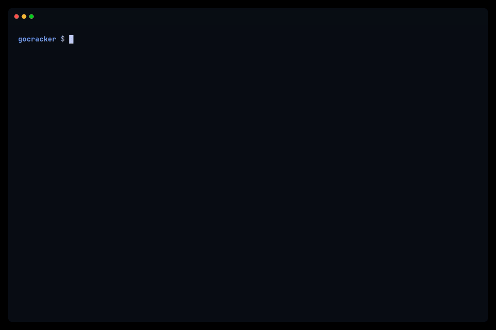
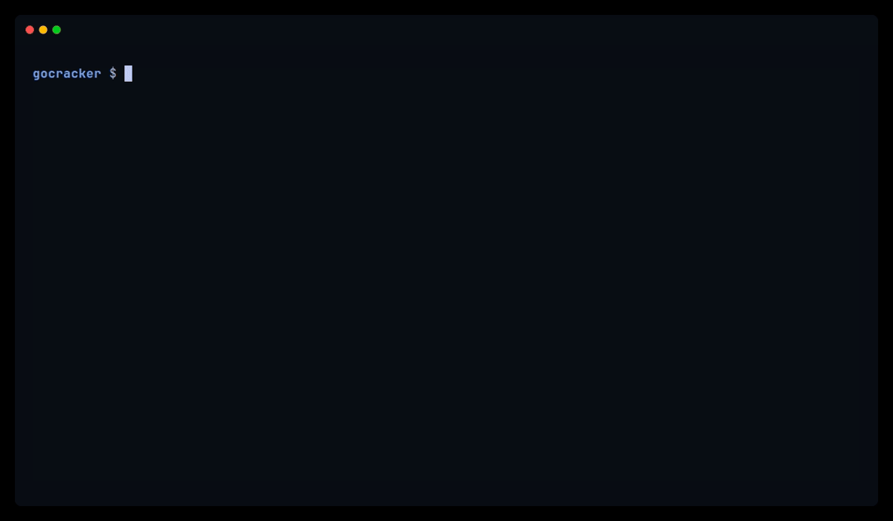

# gocracker

One binary. One command. Real VM isolation.

[](https://go.dev)
[](LICENSE)
[]()

## What is gocracker?

gocracker is a micro-VMM written in pure Go that runs OCI containers as KVM microVMs. Inspired by Firecracker's security model, it pulls OCI images, builds Dockerfiles, clones git repos, and orchestrates Docker Compose stacks -- where each service is a real Linux VM. No Docker daemon, no containerd, no runc. Just KVM.

Think `docker run`, but each container is a real Linux VM.

## Quick Start

```bash
# Build gocracker
make build

# Build a guest kernel (one time)
make kernel-guest

# Run your first microVM
sudo ./gocracker run --image alpine:latest --kernel ./artifacts/kernels/gocracker-guest-standard-vmlinux --cmd "echo hello from a real VM" --wait
```

## Features

**Container Sources** -- OCI images from any registry, local Dockerfiles (BuildKit AST), git repos with auto-detected Dockerfiles, local directories.

**Orchestration** -- Docker Compose stacks as microVMs, healthchecks (CMD/CMD-SHELL executed in-guest), `depends_on` with conditions (`service_healthy`, `service_completed_successfully`), `.env` and interpolation.

**Networking** -- `--net auto` for single-command TAP + IPv4 + NAT, per-stack network namespaces for Compose, manual TAP for advanced setups, deterministic per-VM MAC addresses, port publishing.

**Isolation** -- KVM hardware virtualization, Firecracker-style jailer (`gocracker-jailer`), seccomp filters (per-arch), private mount namespaces, `pivot_root` isolation for builds.

**Operations** -- Snapshot and restore (RAM + vCPU + device state), live migration (stop-and-copy), Firecracker-compatible REST API with extensions, structured logging, event streaming (SSE).

**Devices** -- virtio-net, virtio-blk, virtio-rng, virtio-vsock, virtio-balloon (manual + auto reclaim), virtio-fs, UART 16550A serial console, memory hotplug.

## Examples

### 1. Run Alpine, print a message

```bash
sudo ./gocracker run --image alpine:latest --kernel ./kernel --cmd "echo hello from a real VM" --wait
```


### 2. Interactive Ubuntu session

```bash
sudo ./gocracker run --image ubuntu:22.04 --kernel ./kernel
```

Drops you into a shell inside the VM over the serial console.


### 3. Build from Dockerfile

```bash
sudo ./gocracker run --dockerfile tests/examples/python-api/Dockerfile \
  --context tests/examples/python-api --kernel ./kernel --wait
```

Parses the Dockerfile, builds layers, creates an ext4 disk, and boots the result.



### 4. Clone and boot a git repo

```bash
sudo ./gocracker repo --url https://github.com/user/myapp --kernel ./kernel --wait
```

Clones the repo, auto-detects the Dockerfile, builds, and boots.


### 5. Docker Compose (Flask + PostgreSQL)

```bash
sudo ./gocracker compose \
  --file tests/manual-smoke/fixtures/compose-todo-postgres/docker-compose.yml \
  --kernel ./kernel --wait
```

Each service runs in its own VM. PostgreSQL waits for healthcheck, then the app starts. Port 18081 is published to the host.



### 6. Exec into a running Compose service

```bash
# Start the API server + compose stack
sudo ./gocracker compose --file docker-compose.yml --kernel ./kernel --server http://127.0.0.1:8080

# In another terminal, exec into a service
sudo ./gocracker compose exec --server http://127.0.0.1:8080 --file docker-compose.yml app
```

Opens an interactive shell inside the running VM.



### 7. Networking (auto NAT)

```bash
sudo ./gocracker run --image nginx:alpine --kernel ./kernel --net auto --wait
```

Creates a TAP device, assigns IPv4 addresses, sets up NAT. The guest gets internet access automatically.


### 8. Multi-vCPU

```bash
sudo ./gocracker run --image alpine:latest --kernel ./kernel --cpus 4 --mem 512 \
  --cmd "nproc && free -m" --wait
```



## Platform Support

| Platform | Status | Tested On |
|----------|--------|-----------|
| x86-64 Linux | Full support | Ubuntu 22.04, 24.04 |
| ARM64 Linux | Full support | AWS a1.metal (Graviton 1), Ubuntu 24.04 |
| macOS | Planned | Hypervisor.framework |

### ARM64 / x86-64 Subsystem Comparison

| Subsystem | x86-64 | ARM64 | Notes |
|-----------|--------|-------|-------|
| KVM bindings | `KVM_GET/SET_REGS` | `KVM_GET/SET_ONE_REG` | ARM64 uses per-register ioctls |
| Interrupt controller | IOAPIC + LAPIC | GICv2 / GICv3 (in-kernel) | Auto-probed; GICv2 preferred on Graviton 1 |
| IRQ delivery | `KVM_IRQ_LINE` | irqfd (eventfd) | ARM64 matches Firecracker's irqfd approach |
| Serial console | UART 16550A (I/O port 0x3F8) | UART 16550A (MMIO 0x40002000) | Same device, different transport |
| Boot protocol | bzImage / ELF vmlinux | ARM64 Image / Image.gz / ELF | PC=entry, X0=DTB address |
| Device tree | ACPI (x86) | FDT/DTB (generated) | GIC, timer, PSCI, UART, virtio nodes |
| SMP boot | INIT/SIPI sequence | PSCI CPU_ON | Secondary vCPUs start POWER_OFF |
| Virtio MMIO transport | 0xD0000000+ | 0x40003000+ | Firecracker-compatible layout on ARM64 |
| virtio-net | Done | Done | |
| virtio-blk | Done | Done | |
| virtio-rng | Done | Done | |
| virtio-vsock | Done | Done | |
| virtio-balloon | Done | Done | |
| virtio-fs | Done | Done | |
| Snapshot / Restore | Done | Done | |
| Jailer + seccomp | Done | Done | seccomp filter compiled per-arch |
| Compose networking | Done | Done | TAP + bridge + userspace port proxy |
| Memory layout | RAM at GPA 0x0 | RAM at GPA 0x80000000 | ARM64 reserves low 2 GB for MMIO |

## Networking

### One-command networking

```bash
sudo ./gocracker run --net auto --image nginx:alpine --kernel ./kernel --wait
```

Automatic TAP creation, IPv4 assignment, and NAT. The guest gets internet access with no manual setup.

### Compose networking

Each Compose stack gets an isolated Linux network namespace. Services within a stack communicate by service name. Port publishing maps host ports to guest ports:

```yaml
ports:
  - "18081:8080"   # host:18081 -> guest:8080
```

### How it works

```
Guest VM
  |
virtio-net
  |
TAP device
  |
bridge / NAT (iptables)
  |
Host network
```

## How It Works

1. **Pull** -- Fetch an OCI image from any registry (or build a Dockerfile, or clone a repo)
2. **Extract** -- Unpack layers into an ext4 disk image (pure Go, no `mkfs.ext4`)
3. **Initrd** -- Generate an initrd with an embedded init binary (pure Go, no shell tools)
4. **Create VM** -- Open `/dev/kvm`, configure vCPU, memory, and virtio MMIO devices
5. **Boot** -- Load the kernel, attach the disk and network, start the vCPU run loop
6. **Guest init** -- The init process mounts the disk, sets up the environment, and runs the user command

The device model uses virtio MMIO transport, the same approach Firecracker uses. Each device (net, blk, rng, vsock, balloon, fs) is memory-mapped and interrupt-driven.

## gocracker vs Firecracker

| | Firecracker | gocracker |
|---|---|---|
| Language | Rust | Go |
| OCI image support | No | Yes |
| Dockerfile support | No | Yes |
| Docker Compose | No | Yes |
| ARM64 | Yes | Yes |
| API | REST | REST (Firecracker-compatible + extensions) |
| Jailer | Yes | Yes |
| Seccomp | Yes | Yes |
| virtio devices | net, blk, balloon, vsock | net, blk, rng, vsock, balloon, fs |
| Snapshots | Yes | Yes |
| Live migration | No | Yes |

gocracker builds on Firecracker's proven security model and adds the developer experience layer: pull an image, boot a VM, one command.

## Documentation

- [ARM64 Porting Guide](docs/ARM64_PORTING_GUIDE.md)
- [VFIO GPU Passthrough Plan](docs/VFIO_GPU_PASSTHROUGH_PLAN.md)

## CLI Reference

```
gocracker <command> [flags]

Commands:
  run        Build and boot a microVM (image, Dockerfile, or local path)
  repo       Clone a git repo and boot its Dockerfile
  compose    Boot a docker-compose.yml stack as microVMs
  build      Build a disk image without booting
  restore    Restore and boot a VM from a snapshot
  migrate    Live-migrate a VM between gocracker API servers
  serve      Start the REST API server
  snapshot   Take a snapshot of a running VM via the API

Common flags (run):
  --image       OCI image ref (e.g. ubuntu:22.04)
  --dockerfile  Path to Dockerfile
  --kernel      Kernel image path [required]
  --mem         RAM in MiB (default: 256)
  --cpus        vCPU count (default: 1)
  --disk        Disk size MiB (default: 2048)
  --net         Network mode: none or auto
  --cmd         Override CMD
  --wait        Block until VM stops
  --tty         Console mode: auto, off, or force
  --jailer      Privilege model: on or off (default: on)
```

## Requirements

- Linux kernel 5.10+ with KVM (`/dev/kvm` accessible)
- Go 1.22+ (build from source)
- Network tools: `ip`, `iptables` (for `--net auto`)
- `sudo` for KVM access and networking

Verify your host is ready:

```bash
make hostcheck
```

## License

[Apache License 2.0](LICENSE)
